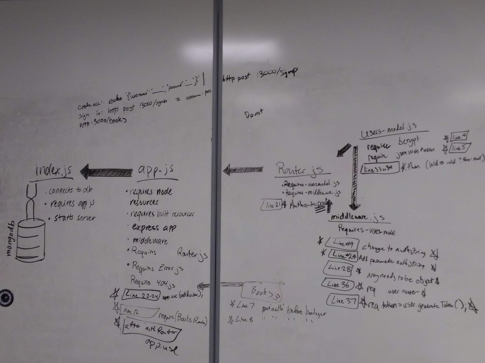

# lab11 LAB
=================================================

## Project Name

### Author: Aaron Ferris
### Collaberators: Jon Gentry, Greg Dukes, Cory Henderson, Alex White

### Links and Resources
* [Pull Request to Master](https://github.com/codefellows-js-401d29-aaron-ferris/lab11/pull/1)
* [travis](https://travis-ci.com/codefellows-js-401d29-aaron-ferris/lab11)
* [heroku deployment](https://apricot-crumble-93192.herokuapp.com)
* I pushed my branch to heroku but it still doesn't show up. Not sure what to do otherwise.

#### Documentation
* [jsdoc](http://xyz.com) (All assignments)

### Modules Modifications
#### index.js
* starts application on port
* connects to mongo database

#### app.js
* imports important 3rd party resources for server
* initiates files
* exports the start function
#### router.js
*  holds the process signing in
*  holds the process signing up
* exports these methods as authrouter
#### users-model.js
* defines the shape of the user class
* includes a save function
* hashes password
* compares the password
* generates a token from the id and secret
#### middleware.js
* changes what is input from the command line into an object to compare
* uses user model to authenticate the user

#### books.js
* handles the get routes

#### 404.js
* handles the incorrect route error

#### error.js
* handles the 

### Modules Modifications
#### `app.js`
* Line 11  added `const books = require('./routes/books.js')`
* Line 23 added `app.use(authRouter());`
* Line 26 added `app.use(books)`

#### `router.js`
* line 21, change get to post

#### `users-model.js`
* Line 4 added`const bcrypt = require('bcrypt');`
* LIne 5 added `const jwt = require('jsonwebtoken')`
* Line 33 added `.then(valid => valid ? this : null)`

#### `middleware.js`
* Line 9, 15 change encodedString to authString
* line 24 added parameter authString
* line 28, array needs to be an object
* line 36 added `req.user=user;`
* line 37 added `req.token=user.generateToken();`

### Setup
#### `.env` requirements
* From starter code, in your filepath base run `npm i`
* Create a .env file with the following lines
  * PORT=3000
  * MONGODB_URI=mongodb://localhost:27017/books
* To test locally do each in separate node filepaths
  * run `mongo`
  * run `mongod -dbpath=/Users/path_to_db/db` you will need to find the route to your db folder for mongo
  * run `nodemon
  * in the node commands:
    * to create account `echo'{"username":"yourusername","password":"yourpassword"}' | http post 3000/signup`
    * to sign in `http post :3000/signin -a yourusername:yourpassword`
    * `http:3000/book`

#### Running the app
* Once everything is set up,
* Endpoint: `/foo/bar/`
  * Returns a JSON object with abc in it.
* Endpoint: `/bing/zing/`
  * Returns a JSON object with xyz in it.
  
#### Tests
* Aside from tests that were already in there
* checked to see if you could go into books route
* checked to see if you could go into books/id route
* checked to see that books would fail without auth

#### UML
